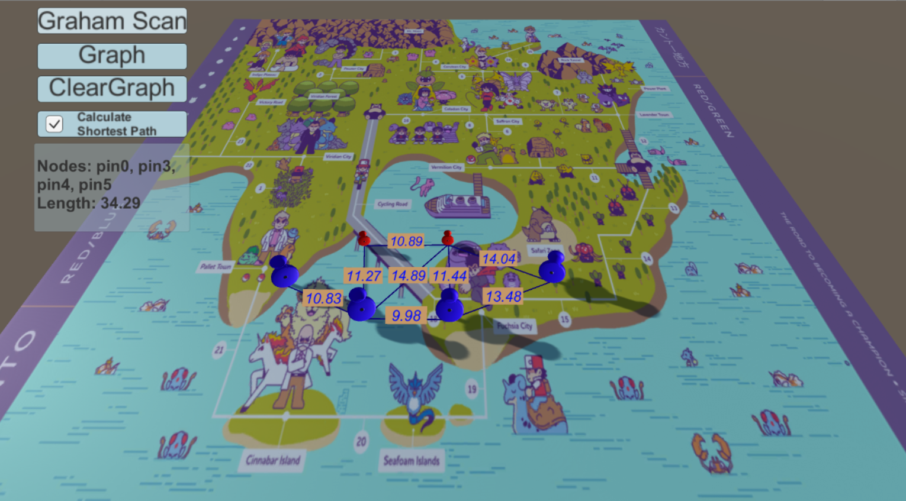
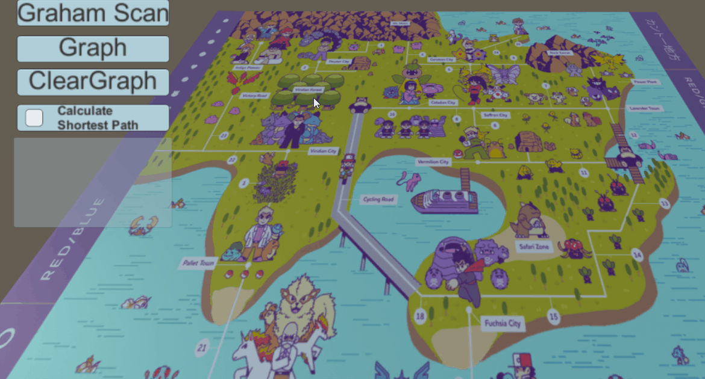

# Unity-Path-Finder

Implemmentation in Unity using Graham Scan Convex Hull and Dijkstras algorithm for path finder.
All the art assets are from free sources.

## Setup
This was developed with Unity 2017.3

This is a Unity project, open it with Unity and you'll be able to run it.

Everybody is welcome to improve this solution, feel free to open a pull request.

## Output:

